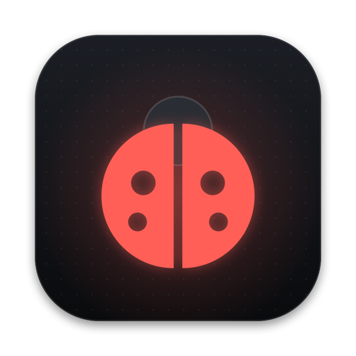
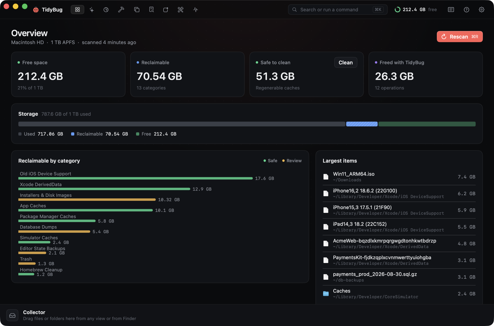

<p align="center">
  
</p>

<h1 align="center">TidyBug</h1>

<p align="center">
  <b>A native macOS disk cleaner for developers.</b><br>
  Finds regenerable caches, build artifacts, duplicates and forgotten installers, shows exactly what each item is and where it lives, and moves only what you approve to the Trash.
</p>

<p align="center">
  <a href="https://tidybug.xeve.io">Website</a> ·
  <a href="https://tidybug.xeve.io/download">Download</a> ·
  <a href="#building-from-source">Build from source</a>
</p>

<p align="center">
  
</p>

## Features

| Tab | What it does |
|---|---|
| **Overview** | Storage breakdown, reclaimable space by category, largest items, recent activity. |
| **Clean** | Checks 19 known locations in parallel (Xcode DerivedData, old iOS Device Support, simulator caches, package-manager caches, app caches, logs, installers, DB dumps…) and groups results by risk: *Safe* (regenerable, pre-selected), *Review*, *Manual*. |
| **Space** | Interactive, hardlink-aware sunburst of any folder. Zoom with a click, drag anything into the **Collector**, delete it all in one go. |
| **Projects** | `node_modules`, Xcode `build`, `.venv`, `Pods`, `target`, `.next`… across your repos, with age and whether a lockfile can restore them. Signed `.xcarchive`/`.ipa` are never touched. |
| **Duplicates** | Exact duplicates (size → partial hash → SHA-256, hardlinks excluded) and similar photos (Vision feature prints). One copy per group is always kept. |
| **Large Files** | Big and old files outside `~/Library`, filterable by kind, with Quick Look. |
| **Apps** | Uninstall apps with their preferences, caches, containers, saved state and launch agents; find leftovers of apps already deleted. |
| **Optimize** | Explainable maintenance (DNS, Launch Services, Quick Look, font caches, Mail/Safari DB compaction, memory) with a diagnosis, a command preview and one admin prompt. |
| **Monitor** | Live CPU per core, memory pressure, GPU, disk and network throughput, battery and thermals, top processes, and a health score. |

Plus: a **Collector** staging area (drag from any view or Finder, then *Delete All*), a **⌘K command palette**, a **menu bar** companion, a **notch overlay** with live CPU/RAM, low-space notifications, Shortcuts actions, and a first-run setup assistant and feature tour.

## Safety model

- **Scanning is read-only.** Nothing moves until you confirm; every clean runs a dry run through the safety guard first and shows you the exact paths.
- **Trash by default.** Permanent deletion is opt-in and limited to regenerable caches.
- **Protected paths** are refused even if selected: `~/Documents`, `~/Desktop`, iCloud Drive, Photos libraries, `.git`, `~/.ssh`, `~/.secrets`, signed `.xcarchive`/`.ipa`, plus anything you add in Settings.
- **Everything is logged** to `~/Library/Logs/TidyBug/operations.jsonl`.
- **Real sizes.** Files are deduplicated by `(device, inode)`, so pnpm stores and APFS clones aren't double-counted.

The guard lives in [`SafetyGuard.swift`](Packages/TidyBugCore/Sources/TidyBugCore/SafetyGuard.swift) and is covered by tests.

## Requirements

- macOS 26 or later, Apple silicon or Intel.
- Full Disk Access is optional but recommended (without it, parts of `~/Library`, Mail, Safari and the Trash can't be sized).

## Building from source

Requires Xcode 26 and [XcodeGen](https://github.com/yonaskolb/XcodeGen).

```sh
brew install xcodegen
git clone https://github.com/xeveio/tidybug.git
cd tidybug
xcodegen generate
open TidyBug.xcodeproj
```

The Xcode project is generated from [`project.yml`](project.yml) and is not checked in. To build without a Developer ID certificate:

```sh
xcodebuild -project TidyBug.xcodeproj -scheme TidyBug -configuration Debug \
  CODE_SIGNING_ALLOWED=NO build
```

Run the core tests:

```sh
cd Packages/TidyBugCore && swift test
```

### Project layout

```
Packages/TidyBugCore/   Scanning, rules, safety guard, cleaner, duplicates, apps, maintenance (+ tests)
TidyBug/App/            App entry, model, theme, root view (tabs, ⌘K palette)
TidyBug/Features/       One folder or file per tab
TidyBug/Components/     Shared views (Collector strip, toasts, controls)
TidyBug/MenuBar/        Menu bar popover
TidyBug/Notch/          Notch overlay
TidyBug/Onboarding/     Setup assistant and feature tour
TidyBug/System/         Updater (Sparkle), system monitor, notifications, App Intents, tips
TidyBug/Demo/           DEBUG-only demo data used for screenshots (`--demo`)
site/                   tidybug.xeve.io (static, Cloudflare Pages)
scripts/                release.sh, deploy-site.sh, screenshots.sh, icon generation
```

## Releasing (maintainers)

Releases are signed with Developer ID, notarized and stapled, and delivered by [Sparkle](https://sparkle-project.org) with an EdDSA-signed appcast at `https://dl.xeve.io/tidybug/appcast.xml`.

```sh
scripts/release.sh 1.0.1 --notes release-notes/1.0.1.md --upload --github
scripts/deploy-site.sh
```

Or push a tag like `tidybug-v1.0.1` to run [`.github/workflows/release.yml`](.github/workflows/release.yml). Signing, notarization and upload credentials are repository secrets and are never committed.

## Contributing

Issues and pull requests are welcome. Please keep changes safe by default: anything that can remove files must go through `SafetyGuard` and `Cleaner`, and new clean rules need a test. Run `swift test` before opening a PR.

## License

TidyBug is free software, licensed under the [GNU General Public License v3.0](LICENSE).

Copyright © 2026 Xeve.
